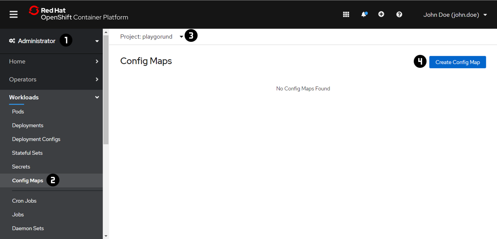
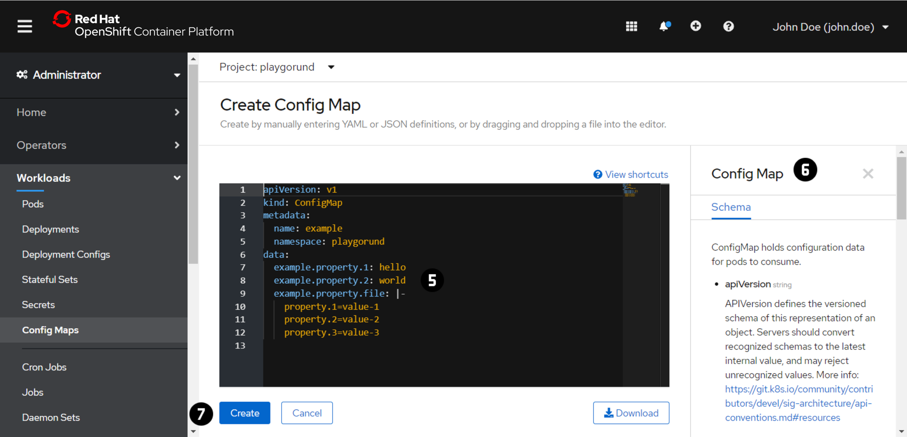
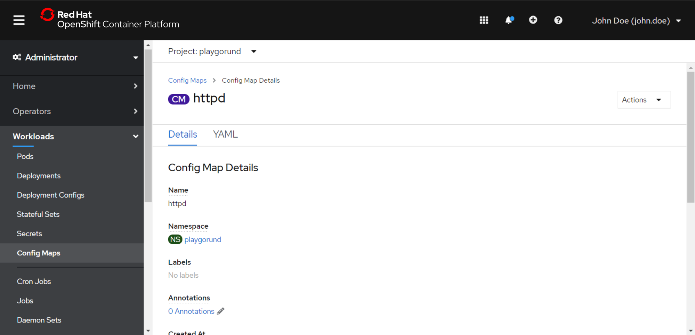
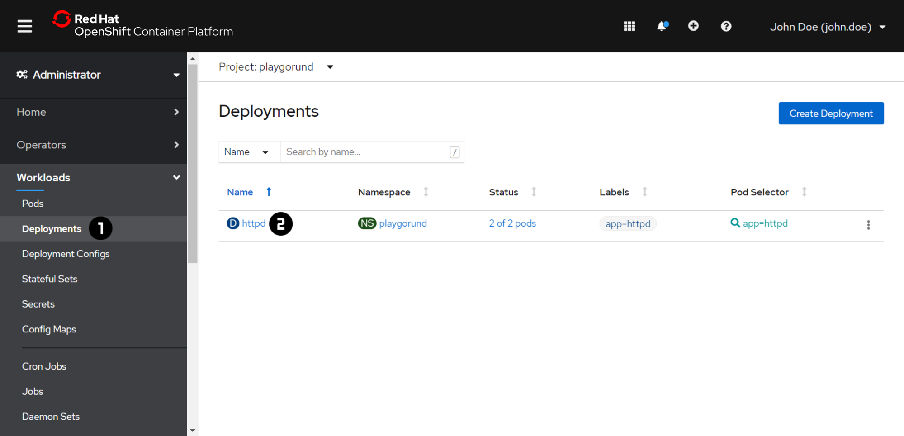
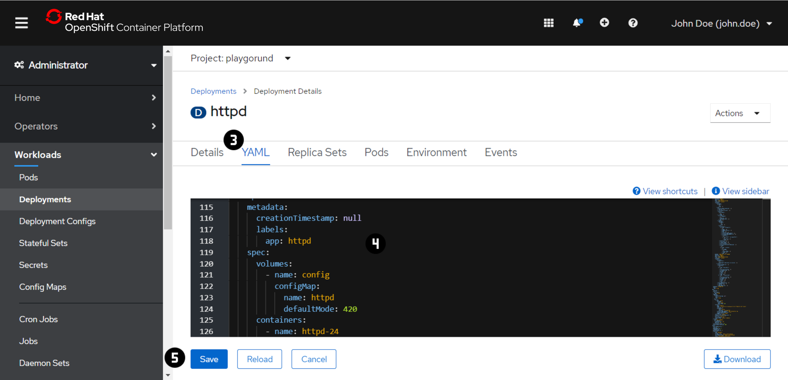

# Exercise 4 - ConfigMaps

We want to change the `index.html` served by the Apache HTTP Server in order to personalize our website.
There are multiple approaches to achieve this:

- change the container image by adding the file during the build to the image (out of scope for this workshop)
- use a `ConfigMap` to inject the file to the container in the `Pod`

`ConfigMap` provides a mechanisms to inject containers with configuration data (entire files or single values) while keeping the containers unchanged. 

_Check out the [OpenShift](https://docs.openshift.com/container-platform/4.9/applications/config-maps.html) or [Kubernetes](https://kubernetes.io/docs/concepts/configuration/configmap/) Documentation for more information about `ConfigMaps`._

!!! note
    For each exercise you can choose and only have to do either the 'Web Console' or the 'Command Line 
    Interface (CLI)' section in oder to complete the exercise.

=== "Web Console"
    ### Create a `ConfigMap`
    
    

    1. Switch to the 'Administrator' view using the dropdown menu at :material-numeric-1-circle:.
    2. Navigate to 'Workloads' → 'Config Maps' :material-numeric-2-circle:.
    3. Switch to the your project using the dropdown menu at :material-numeric-3-circle:.
       In each of the exercise make sure that you are in your project context before you are making any changes.
    4. Press 'Create Config Map' :material-numeric-4-circle:.
    5. Create a `ConfigMap` with the `index.html` using the content below:
        ```html
        <!DOCTYPE html>
        <html>
        <head>
            <title>John Doe</title>
        </head>
        <body>
            <h1>John Doe</h1>
            <p>
            Today I learned how to deploy my own website in the cloud
            using an Apache HTTP Server (httpd) running on OpenShift.
            </p>
        </body>
        </html>
        ```
        (replace `John Doe` with your actual name - if you are John Doe you can skip this)

        ??? question "Try to create the `ConfigMap` definition file on your own using the template at :material-numeric-5-circle: and the additional schema information :material-numeric-6-circle:"

            _Solution:_
            ```yaml
            apiVersion: v1
            kind: ConfigMap
            metadata:
              name: httpd
            data:
              index.html: |-
                <!DOCTYPE html>
                <html>
                <head>
                    <title>John Doe</title>
                </head>
                <body>
                    <h1>John Doe</h1>
                    <p>
                    Today I learned how to deploy my own website in the cloud
                    using an Apache HTTP Server (httpd) running on OpenShift.
                    </p>
                </body>
                </html>
            ```

    6. Press 'Create' :material-numeric-7-circle:.
  
    

    ### Mount a `ConfigMap`
    
    

    1. Navigate to 'Workloads' → 'Deployments' :material-numeric-1-circle:.
    2. Open the 'Deployment Details' by clicking on the 'Name' :material-numeric-2-circle:.
    3. Switch to the 'YAML' tab :material-numeric-3-circle:.
    4. Add the ==highlighted== parts to the `Deployment` defintion file in the editor :material-numeric-4-circle::
        ``` hl_lines="12 13 14 15 18 19 20"
        apiVersion: apps/v1
        kind: Deployment
        ...
        spec:
          ...
          template:
            metadata:
              creationTimestamp: null
              labels:
                app: httpd
            spec:
              volumes:
              - name: html
                configMap:
                  name: <configmap name> 
              containers:
              - image: rhscl/httpd-24-rhel7:latest
                volumeMounts:
                - name: html
                  mountPath: /var/www/html
                ...
        ```
    5. Press 'Save' :material-numeric-5-circle:.
    6. Reload your web site using the URL of the `Route` created in [Exercise 3](/powercoders/networking).

=== "Command Line Interface (CLI)"
    !!! important
        At the beginning of the exercise make sure that you are in your project context. 
        ```
        oc project <project name> 
        ```

    ### Create a `ConfigMap`
    1. Create a `index.html` file using the [`vi` editor](/powercoders/vieditor/) with the following content:
        ```html
        <!DOCTYPE html>
        <html>
        <head>
            <title>John Doe</title>
        </head>
        <body>
            <h1>John Doe</h1>
            <p>
            Today I learned how to deploy my own website in the cloud
            using an Apache HTTP Server (httpd) running on OpenShift.
            </p>
        </body>
        </html>
        ```
        (replace `John Doe` with your actual name - if you are John Doe you can skip this)
    2. Create a `ConfigMap` with the `index.html`.

        ??? question "Try to figure out how to create a new configmap named `httpd` based on a file using `oc create configmap -h`"

            _Solution:_
            ```
            oc create configmap httpd --from-file=index.html
            ```
    
    ### Inspect a `ConfigMap`
    1. Inspect the created `ConfigMap` using `oc get` and `oc describe`.
        ```
        oc get configmaps
        ```
        ```
        oc describe configmap <configmap name>
        ```
    2. Also check the `ConfigMap` in the Web Console.

    ### Mount a `ConfigMap`
    1. Let's add the `ConfigMap` to the `Pod` template in the `Deployment`.
        The `oc edit` command allows us to edit existing resources using the [`vi` editor](/powercoders/vieditor/).
        ```
        oc edit deployment <deployment name>
        ```
    2. Add the ==highlighted== parts to the `Deployment`:
        ``` hl_lines="12 13 14 15 18 19 20"
        apiVersion: apps/v1
        kind: Deployment
        ...
        spec:
          ...
          template:
            metadata:
              creationTimestamp: null
              labels:
                app: httpd
            spec:
              volumes:
              - name: html
                configMap:
                  name: <configmap name> 
              containers:
              - image: rhscl/httpd-24-rhel7:latest
                volumeMounts:
                - name: html
                  mountPath: /var/www/html
                ...
        ```
    3. Store and close the file.
        The configuration change triggers automatically a redeployment of all your `Pods` - wait a couple of seconds until it is done.
    4. Reload your web site using the URL of the `Route` created in [Exercise 3](/powercoders/networking).


### **🎉 Congratulations, you have made it!**
You have successfully deployed your first personal website in the cloud using OpenShift. 👏