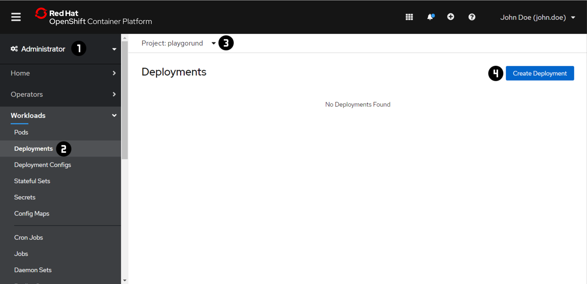
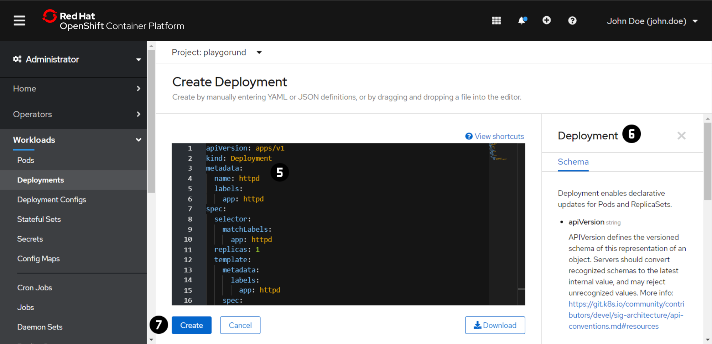
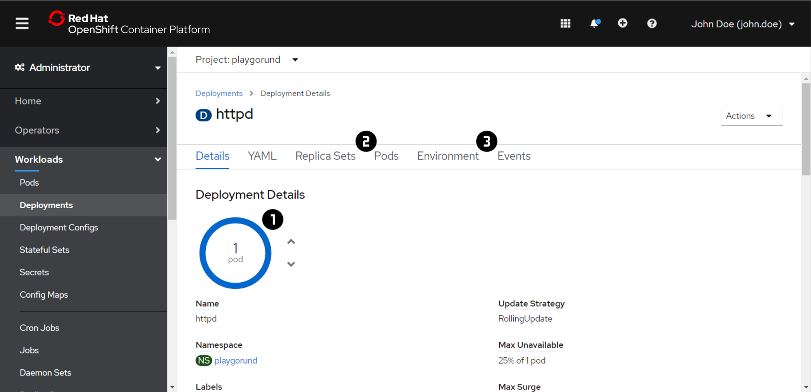
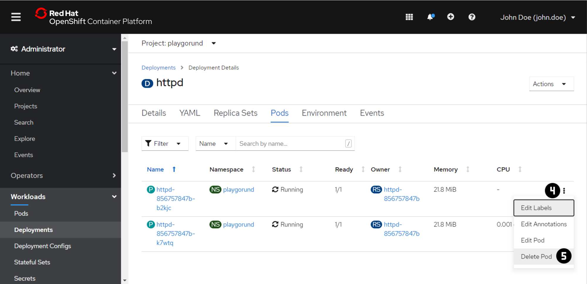
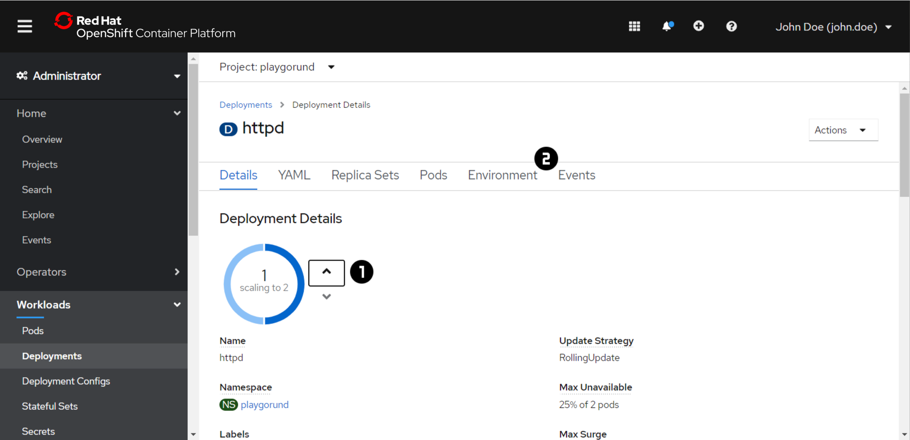

# Exercise 2 - Deployments
You describe the desired state of your application in a `Deployment` by specifying the number of replicas and a `Pod` template.
The `Deployment` involve a `ReplicaSet` to manage the `Pods` in the background.

The `ReplicaSet` ensures that specified number of `Pod` replicas are running all the time.
If a `Pod` crashes or is deleted the `ReplicaSet` creates new instances up to the defined number.
Likewise, if there are more `Pods` running than desired, it deletes as many as necessary.

_Check out the [OpenShift](https://docs.openshift.com/container-platform/4.9/applications/deployments/what-deployments-are.html#deployments-repliasets_what-deployments-are) or [Kubernetes](https://kubernetes.io/docs/concepts/workloads/controllers/deployment/) Documentation for more information about `Deployments` and `ReplicaSets`._

!!! note
    For each exercise you can choose and only have to do either the 'Web Console' or the 'Command Line 
    Interface (CLI)' section in oder to complete the exercise.

=== "Web Console"
    ### Create a `Deployment`
    
    

    1. Switch to the 'Administrator' view using the dropdown menu at :material-numeric-1-circle:.
    2. Navigate to 'Workloads' → 'Deployments' :material-numeric-2-circle:.
    3. Switch to the your project using the dropdown menu at :material-numeric-3-circle:.
       In each of the exercise make sure that you are in your project context before you are making any changes.
    4. Press 'Create Deployment' :material-numeric-4-circle:.
    5. Copy the following `Deployment` definition file to the editor :material-numeric-5-circle::
    ```yaml
    apiVersion: apps/v1
    kind: Deployment
    metadata:
      name: httpd
      labels:
        app: httpd
    spec:
      replicas: 1
      selector:
        matchLabels:
          app: httpd
      template:
        metadata:
          labels:
            app: httpd
        spec:
          containers:
          - name: httpd-24
            image: rhscl/httpd-24-rhel7:latest
    ```
    _More detailed information about the `Deployment` definition file can be found in the Tab at :material-numeric-6-circle:._
    6. Press 'Create' :material-numeric-7-circle:.

    ### Inspect a `Deployment`
    

    !!! note
        If you have created the `Deployment` using the CLI:

        1. Repeat the steps 1 - 3 of the 'Create a Deployment' task above
        2. Open the 'Deployment Details' by clicking on the `Deployment` name in the 'Deployments' overview table. 

    1. Check the 'Details' and status of the `Pods` of a `Deployment` by moving the mouse over the blue circle :material-numeric-1-circle:.
        The status should be 'Running' after a couple of seconds.
    2. Additionally check the 'Pods' :material-numeric-2-circle: and the 'Events' :material-numeric-3-circle:

    ??? question "What is the difference between the `Pod` that was created manually and the one that was created by the `Deployment`?"

        _Solution:_

        The `Pod` created from the `Deployment` have a random name.

        _Example:_
        ```
        httpd-12cf4d11ce-p9w5h
        ```
        The `Deployment` adds a random string (e.g. `12cf4d11ce`) to the deployment name while creating the `ReplicaSet`.
        The `ReplicaSet` itself adds  another random string to the each `Pod` (e.g. `p9w5h`).
  
    

    ??? question "What happens if you delete a pod by opening :material-numeric-4-circle: in the 'Pods' tab and clicking :material-numeric-5-circle:?"

        _Solution:_

        The `ReplicaSet` of the `Deployment` automatically creates a new `Pod`. The same would happen if the application in the container of the `Pod` crashed or terminated. Check the 'Events' again to see what happend.
    
    
    ### Scale a `Deployment`
    

    1. Scale the `Deployment` to have another `Pod` of the application to achieve a redundant and stable setup by clicking on the up arrow at :material-numeric-1-circle:.
    2. Wait until both `Pods` are running and inspect agin the 'Events' :material-numeric-2-circle:.

=== "Command Line Interface (CLI)"
    !!! important
        At the beginning of the exercise make sure that you are in your project context. 
        ```
        oc project <project name> 
        ```

    ### Create a `Deployment`
    1. Create a `Deployment` of the Apache HTTP Server using the `oc create` command:
        ```
        oc create deployment httpd --image rhscl/httpd-24-rhel7:latest
        ```
        The output of the command should look this:
        ```
        [~] $ oc create deployment httpd --image rhscl/httpd-24-rhel7:latest
        deployment.apps/httpd created
        ```

    ### Inspect a `Deployment`
    1. Let's verify the state of the `Deployment` that you have created using `oc get` and `oc describe`.
        ```
        oc get deployments -o wide
        ```
        ```
        oc describe deployment <deployment name>
        ```

    2. Inspect the pods the `Deployment` has created.
        ```
        oc get pods
        ```
        ```
        oc get pods -o wide
        ```

        ??? question "What is the difference between the `Pod` that was created manually and the one that was created by the `Deployment`?"

            _Solution:_

            The `Pod` created from the `Deployment` have a random name.

            _Example:_
            ```
            httpd-12cf4d11ce-p9w5h
            ```
            The `Deployment` adds a random string (e.g. `12cf4d11ce`) to the deployment name while creating the `ReplicaSet`.
            The `ReplicaSet` itself adds  another random string to the each `Pod` (e.g. `p9w5h`).

        ??? question "What happens if you delete a pod using `oc delete pod <pod name>`?"

            _Solution:_

            The `ReplicaSet` of the `Deployment` automatically creates a new `Pod`. The same would happen if the application in the container of the `Pod` crashed or terminated.

    3. Also check the 'Inspect a Deployment' section for the Web Console.
    
    ### Scale a `Deployment`
    1. Scale the `Deployment` to have another `Pod` of the application to achieve a redundant and stable setup.
        ```
        oc scale deployment <deployment name> --replicas=2
        ```
    2. Inspect the `Deployment` and pods again.