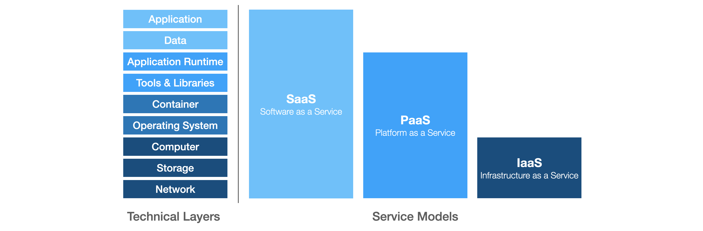

# Introduction to Cloud Computing
The **Introduction to Cloud Computing** workshop was created in November 2020 for the [Powercoders](https://powercoders.org/) project with the intention to teach the participants how to deploy a website in the cloud using an Apache HTTP Server `httpd` running on RedHat OpenShift 4.5.

## Definition
### NIST Definition of Cloud Computing [^1]
**Cloud computing** is a model for enabling ubiquitous, convenient, on-demand network access to a shared
pool of configurable computing resources (e.g., networks, servers, storage, applications, and services) that
can be rapidly provisioned and released with minimal management effort or service provider interaction.

The NIST cloud model is composed of five essential characteristics:

- On-demand self-service
- Broad network access
- Resource pooling
- Rapid elasticity
- Measured service

### Service Models

**Software as a Service (SaaS)** is a service model where applications running on a cloud infrastructure are offered to the customers. The customer itself does not need to manage or control underlying infrastructure such as network, storage, operating systems or servers. However, some limited user configuration of the application might be possible. In general the applications are accessed using a thin client (e.g. web browser).

_Examples:_ Slack, Microsoft365, Dropbox, Zoom

**Platform as a Service (PaaS)** is a service model which offers an environment to deploy and operate customer-created application on a cloud infrastructure. The applications can be developed using programming languages, tools and libraries which are supported by the provider.
As for SaaS, the customer does not need to manage or control the underlying infrastructure himself.

_Examples:_ OpenShift, Azure Kubernetes Service (AKS), Heroku

**Infrastructure as a Service (IaaS)** is a service model where a customer can provision fundamental computing resources as well as storage and networks. The customer has full control of the software (i.e. applications and operating system) on the system, whereas the underlying cloud infrastructure remains controlled and managed by the provider.

_Examples:_ Google Compute Engine (GCE), Amazon Web Services (AWS), Microsoft Azure

### Deployment Models
<figure>
  
</figure>

**Public Cloud**. The cloud infrastructure offered by third-party providers (e.g. Microsoft Azure, Amazon Web Services, Google Cloud, Alibaba Cloud) to be used by the general public.

**Private Cloud**. The cloud infrastructure is dedicated to a single organization and the provisioned resources are only shared within the business units of that organization. The infrastructure is often owned by the organization and deployed on-premise.

**Hybrid Cloud** is a combination of the previously introduced deployment models. The private and public cloud's resource are still independent from each other, however the services are connected, which enables the portability of data and applications.

## Why Cloud?
### Focus
Cloud Computing enables organizations to focus on application development because they don't need to take additional efforts to install and maintain the infrastructure (e.g. servers, storage, networks) needed in order to run their application and services.
Additionally, cloud services abstract the complexity of the technical layers by providing a single API to interact with the underlaying infrastructure which facilitate DevOps practices.

### Scalability
Cloud infrastructure can be provisioned rapidly and on-demand, allowing organizations to react flexibly to changes in the demand for their services. The resources in the cloud, and therefore often the applications running on them, can be scaled up and down in time in order to support fluctuating workloads.

### Cost Savings
In the cloud the compute resources are often charged based on usage (*pay-as-you-go*). Therefore an organization does not spend money on features they don't want to use or spends less money for features which are only used rarely. Due to the flexibility in the cloud, no overcapacity which might only be used in the near future is required, which also further reduces the costs.  

[^1]:
    Peter M. Mell and Timothy Grance. 2011. SP 800-145. The NIST Definition of Cloud Computing. Technical Report. National Institute of Standards & Technology, Gaithersburg, MD, USA. [Link](https://nvlpubs.nist.gov/nistpubs/Legacy/SP/nistspecialpublication800-145.pdf)
