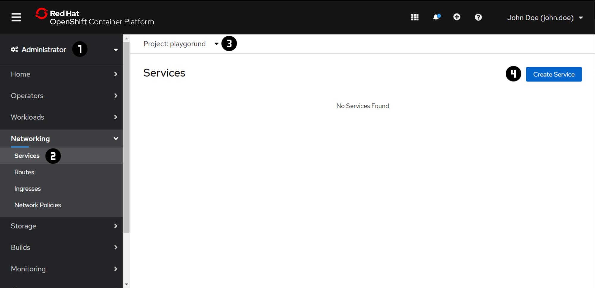
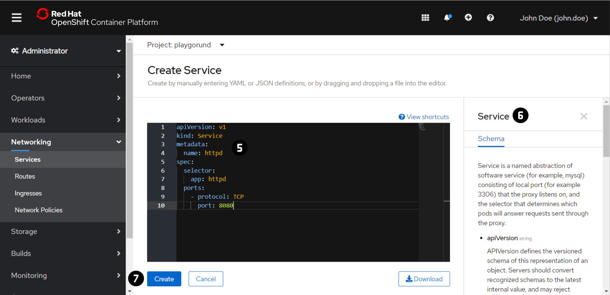
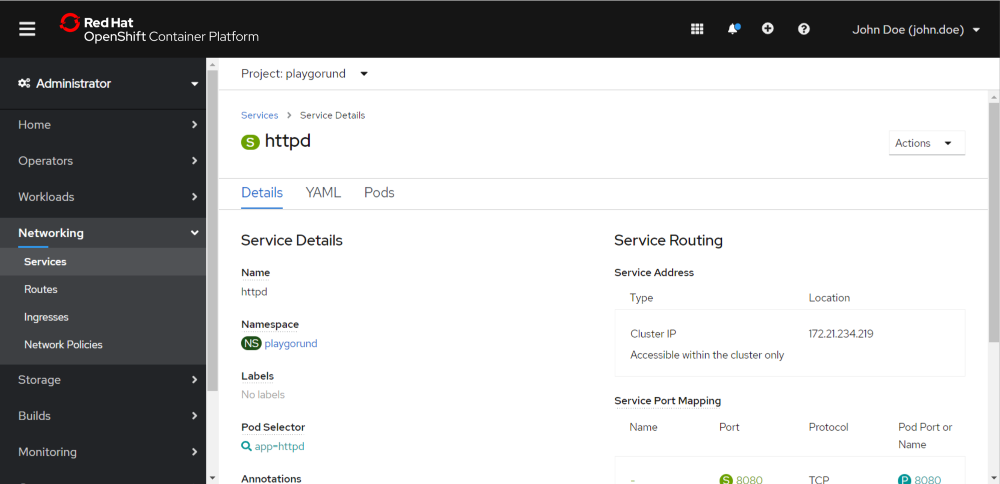
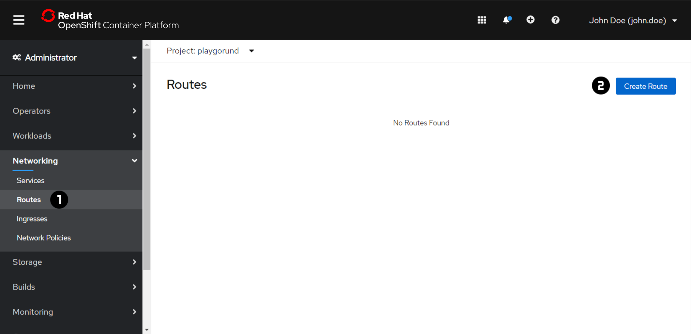
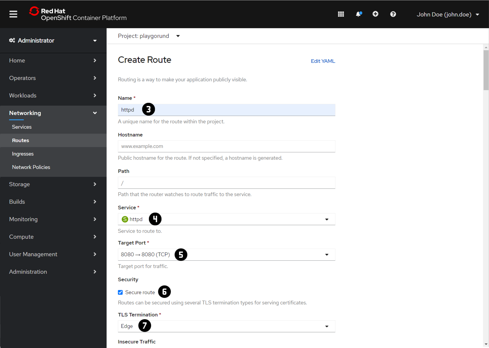
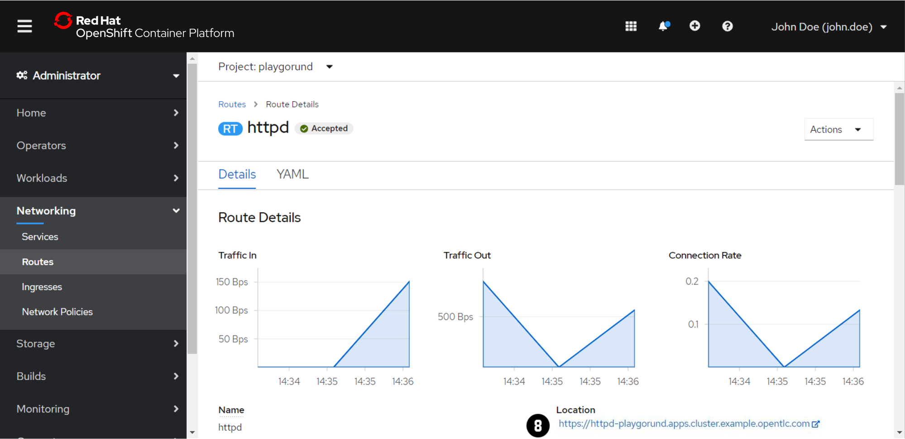

# Exercise 3 - Networking
Each `Pod` has its own IP address in order to access the application on it over the network.
However,`Pods` are non-permanent resources which are created and destroyed by the `Deployment` dynamically.
Therefore the IP addresses of your application are changing dynamically too and it is difficult to keeps track of which IP address to connect to.

## Services
The `Service` is an abstract way to expose an application running on a set of `Pods` and load-balance the requests across them.
Instead of connecting to the IP addresses of the `Pods` directly you can connect instead to its `Service`.

_Check out the [Kubernetes](https://kubernetes.io/docs/concepts/services-networking/service/) Documentation for more information about `Services`._

##Routes
The `Route` allows to expose services through HTTP(S) via a public DNS entry. This is needed to make `Services` accessible from outside of the cluster.
 
_Check out the [OpenShift](https://docs.openshift.com/container-platform/4.5/rest_api/network_apis/route-route-openshift-io-v1.html) Documentation for more information about `Routes`._

!!! note
    For each exercise you can choose and only have to do either the 'Web Console' or the 'Command Line 
    Interface (CLI)' section in oder to complete the exercise.

=== "Web Console"
    ### Create a `Service`
    
    

    1. Switch to the 'Administrator' view using the dropdown menu at :material-numeric-1-circle:.
    2. Navigate to 'Networking' → 'Services' :material-numeric-2-circle:.
    3. Switch to the your project using the dropdown menu at :material-numeric-3-circle:.
       In each of the exercise make sure that you are in your project context before you are making any changes.
    4. Press 'Create Service' :material-numeric-4-circle:.
    5. Let's create a `Service` for the port `8080`. Copy the following `Service` definition file to the editor :material-numeric-5-circle: and replace `<port>` and `<app label>` with the correct value:
    ```yaml
    apiVersion: v1
    kind: Service
    metadata:
      name: httpd
    spec:
      selector:
        app: <app label>
      ports:
        - protocol: TCP
          port: <port>
    ```
    _More detailed information about the `Service` definition file can be found in the Tab at :material-numeric-6-circle:._
    6. Press 'Create' :material-numeric-7-circle:.

    

    ### Create a `Route`
    
    

    1. Navigate to 'Networking' → 'Routes' :material-numeric-1-circle:.
    2. Press 'Create Route' :material-numeric-2-circle:.
    3. Set the 'Name' :material-numeric-3-circle: to `httpd`.
    4. Select the 'Service' you have created above in :material-numeric-4-circle:.
    5. Choose the 'Target Port' `8080` from the dropdown menu :material-numeric-5-circle:.
    6. Let's secure the `Route` by enabling the checkbox :material-numeric-6-circle: and selecting 'Edge' for 'TLS Termination' :material-numeric-7-circle:.
    7. Scroll until the end of the page and press 'Create'.
    8. Open the link :material-numeric-8-circle: at the 'Route Details' page in order to test the route.

    


=== "Command Line Interface (CLI)"
    !!! important
        At the beginning of the exercise make sure that you are in your project context. 
        ```
        oc project <project name> 
        ```

    ### Create a `Service`
    1. Create a `Service` for the port `8080` of the `Deployment` that we have created in [Exercise 2](/powercoders/deployment):
        ```
        oc expose deployment <deployment name> --port=<port>
        ```
    2. Inspect the `Service` using the `oc get` or the `oc describe` command.
        ```
        oc get service -o wide
        ```
        ```
        oc describe service <service name>
        ```

        ??? question "How many endpoints are connected to your `Service` and why?"

            _Solution:_ 

            There are **2 endpoints** connected to your `Service`, you can figure that out by using the `oc describe` command.
            
            ```
            [~] $ oc describe service <service name>
            ...
            Endpoints: <IP endpoint 1>:8080,<IP endpoint 2>:8080
            ...
            ```

            The reason that there are 2 endpoints is that we have 2 replicas configured in the `Deployment`.
            Let's compare the IP addresses of the endpoints with the IP address of each `Pod`. 
            The IP address of the `Pods` can be retrieved using the `oc get pods -o wide` command.
            As you can see the `Service` is successfully connected to all `Pods` of your `Deployment`.
            

    ### Create a `Route`
    1. Create a `Route` in order to make the `Service` accessible from outside of the cluster.
        ```
        oc create route edge httpd --service=<service name>
        ```
    2. Inspect the new `Route` using the `oc get` command.
        ```
        oc get routes
        ```
    3. Try to connect to the `https://HOST` of the `Route` using the browser in order to test the route.
