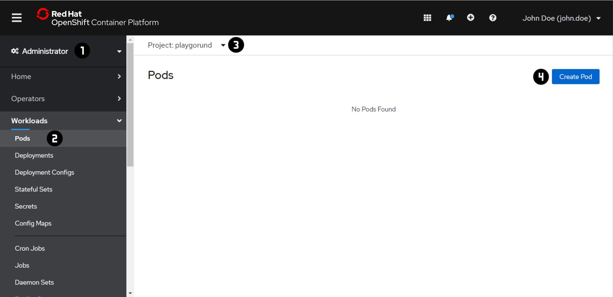
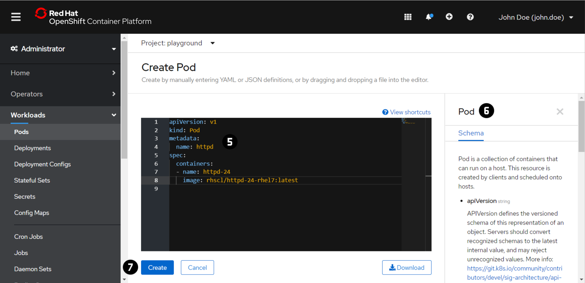
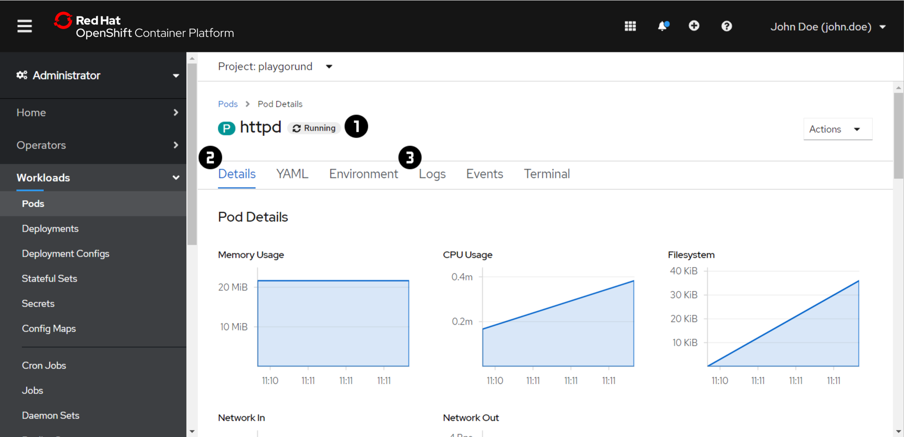

# Exercise 1 - Pods
The goal of this exercise is to run our first application, an Apache HTTP Server, in OpenShift.
For this we use a `Pod` which is the smallest deployable unit of computing that you can create 
and manage in OpenShift. A `Pod` is a group of one or more containers. In this exercise, we will
deploy a `Pod` that runs a single container with the image `rhscl/httpd-24-rhel7:latest`.

!!! note
    For each exercise you can choose and only have to do either the 'Web Console' or the 'Command Line 
    Interface (CLI)' section in oder to complete the exercise.

=== "Web Console"
    ### Create a `Pod`
    
    

    1. Switch to the 'Administartor' view using the dropdown menu at :material-numeric-1-circle:.
    2. Navigate to 'Workloads' → 'Pods' :material-numeric-2-circle:.
    3. Switch to the your project using the dropdown menu at :material-numeric-3-circle:.
       In each of the exercise make sure that you are in your project context before you are making any chnages.
    4. Press 'Create' :material-numeric-4-circle:.
    5. Copy the following `Pod` definition file to the editor :material-numeric-5-circle::
        ```yaml
        apiVersion: v1
        kind: Pod
        metadata:
          name: httpd
        spec:
          containers:
          - name: httpd-24
            image: rhscl/httpd-24-rhel7:latest
        ```
        _More detailed information about the `Pod` definition file  can be found in the Tab at :material-numeric-6-circle:._
    6. Press 'Create' :material-numeric-7-circle:.
    
    ### Inspect a `Pod`
    

    !!! note
        If you have created the `Pod` using the CLI:

        1. Repeat the steps 1 - 3 of the 'Create a Pod' task above
        2. Open the 'Pod Details' by clicking on the `Pod` name in the 'Pods' overview table. 

    1. Check the status of the `Pod` at :material-numeric-1-circle:. The status should be 'Running' after a couple of seconds.
    2. Check the 'Details' :material-numeric-2-circle: of your `Pod`.
    3. In order to verify if the application in the `Pod` was started succefullt have a quick look into the 'Logs' :material-numeric-3-circle:.
    4. Also check the 'Inspect a Pod' section for the CLI.
    
    ### Delete a `Pod`
    

    You won't need the `Pod` in the following exercises, therefore clean up your project.

    1. Navigate to the 'Actions' dropdown menu :material-numeric-1-circle: in the 'Pod Details'.
    2. Press 'Delete Pod' :material-numeric-2-circle:.


=== "Command Line Interface (CLI)"
    !!! important
        At the beginning of the exercise make sure that you are in your project context. 
        ```
        oc project <project name> 
        ```
        (replace `<projet name>` with the actual name of your own project)

    ### Create a `Pod`
    1. Create a `Pod` definition file called `pod.yaml` using the [`vi` editor](/powercoders/vieditor/) with the following content:
        ```yaml
        apiVersion: v1
        kind: Pod
        metadata:
          name: httpd
        spec:
          containers:
          - name: httpd-24
            image: rhscl/httpd-24-rhel7:latest
        ```
       _More detailed information about the `Pod` definition file  can be found in the
       [OpenShift](https://docs.openshift.com/container-platform/4.5/nodes/pods/nodes-pods-using.html#nodes-pods-using-example_nodes-pods-using-ssy) or [Kubernetes](https://kubernetes.io/docs/concepts/workloads/pods/) Documentation._
       
    2. Create a `Pod` by using the `oc apply` command.
        ```
        oc apply -f pod.yaml
        ```
        The output of the command should look like this:
        ```
        [~] $ oc apply -f pod.yaml
        pod/httpd created
        ```
    
    ### Inspect a `Pod`
    1. Let's verify the state of the `Pod` that you have created using `oc get`.
        ```
        oc get pods 
        ```
        You can choose the output format `<output format>` with the `-o` flag. 
        Try some of the formats: `wide`, `json`, `yaml`
        ```
        oc get pods -o <output format>
        ```
    2. `oc describe` can be used to get detailed description of a given resource. 
        Inspect the information and events of your `Pod`.
        ```
        oc descirbe pod <pod name>
        ```
    3.  Print the logs for a container in a `Pod` using the `oc logs` command
        in order to check if the application in the `Pod` was started successfully.
        ```
        oc logs <pod name>
        ```
    4. Also check the 'Inspect a Pod' section for the Web Console.
    
    ### Delete a `Pod`
    1. You won't need the `Pod` in the following exercises, therefore clean up your project.
        ```
        oc delete pod <pod name>
        ```