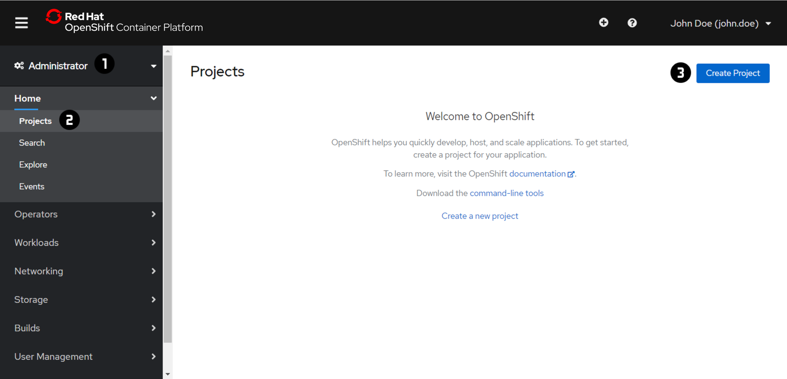
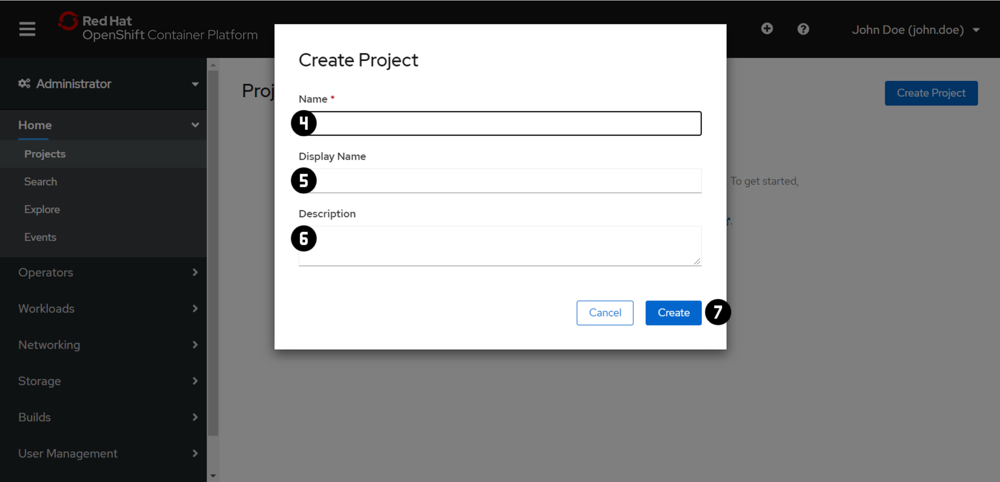

# Exercise 0 - Projects
First of all everyone needs his own OpenShift Project, so let's create one.

!!! note
    For each exercise you can choose and only have to do either the 'Web Console' or the 'Command Line 
    Interface (CLI)' section in oder to complete the exercise.

=== "Web Console"
    ### Create a Project
    
    

    1. Switch to the 'Administartor' view using the dropdown menu at :material-numeric-1-circle:.
    2. Navigate to 'Home' → 'Projects' :material-numeric-2-circle:.
    3. Press 'Create Project' :material-numeric-3-circle:.
    4. Set the 'Name' :material-numeric-4-circle: to `playground-user<id>` (replace `<id>` with your actual ID) and choose a 'Display Name' :material-numeric-5-circle: as well as a 'Description' :material-numeric-6-circle: (write down your 'Project Name' you will need that in the following Exercises).
    6. Press 'Create' :material-numeric-7-circle:.

=== "Command Line Interface (CLI)"
    1. Create your own 'Project' using the `oc new-project` command and write down your 'Project Name' you will need that in the following Exercises.
        ```
        oc new-project playground-user<id>
        ```
        (replace `<id>` with your actual ID)
    2. Switch to your 'Project' using `oc project`.
        ```
        oc project <project name>
        ```